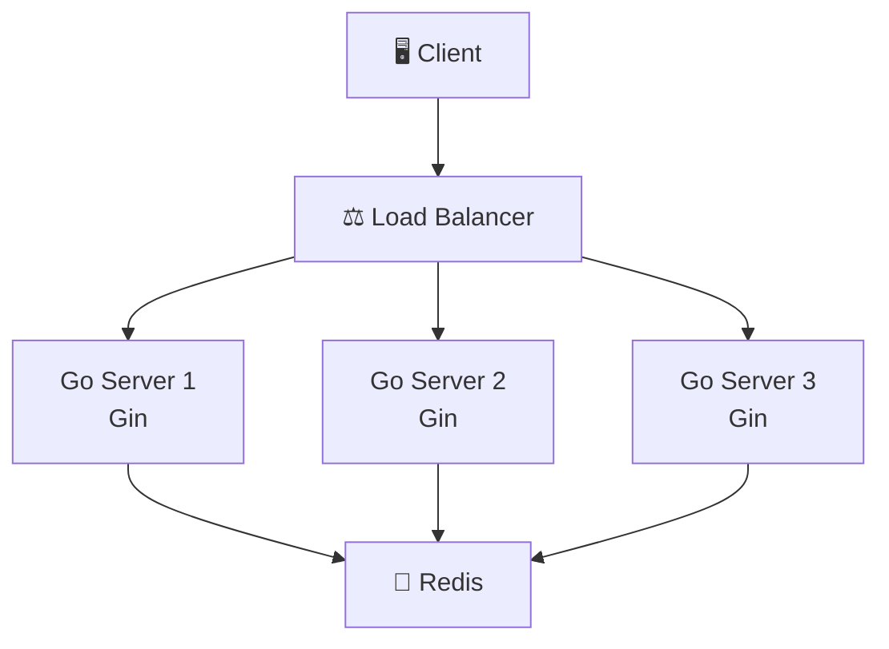
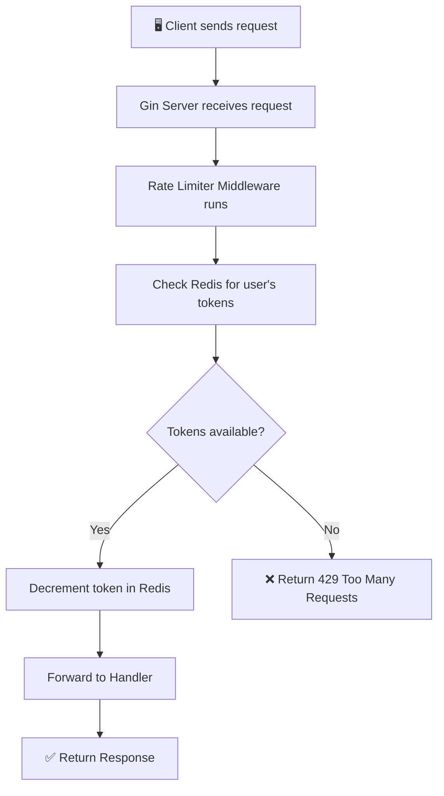
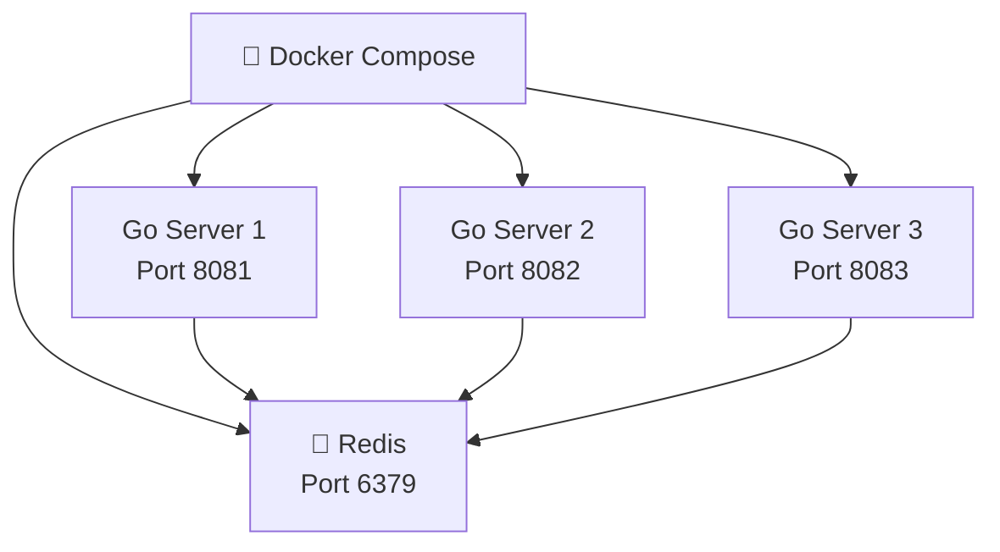
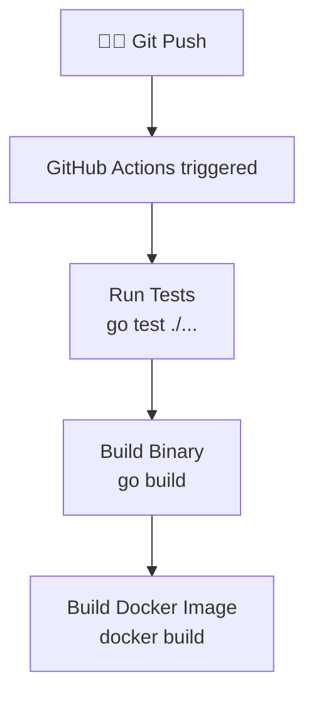
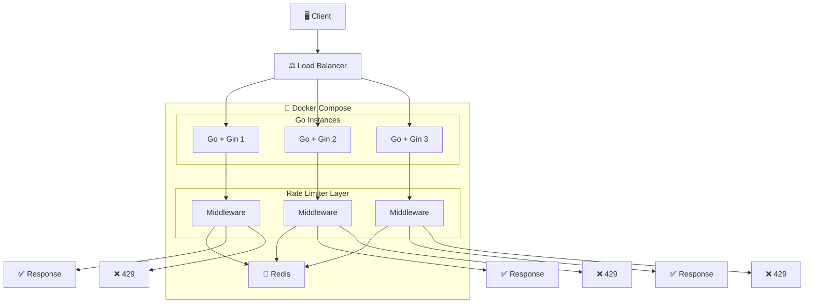

# Distributed Rate Limiter — Architecture

---

## 1. Project Overview

### What is a rate limiter?

A rate limiter controls how many requests a user (or client) can make to your server in a given time window. For example: **"Allow a maximum of 10 requests per minute per user."** If the user exceeds that limit, the server responds with **429 Too Many Requests** instead of processing the request.

### Why do we need it?

- **Prevent abuse** — stops a single user from flooding the server with requests.
- **Protect resources** — keeps the server stable under heavy traffic.
- **Fair usage** — ensures every user gets a fair share of the server's capacity.

### What makes it distributed?

In production, you don't run just one server — you run **multiple instances** behind a load balancer. If each server tracks rate limits independently, a user could hit Server 1 five times and Server 2 five times, effectively doubling their limit.

A **distributed** rate limiter solves this by storing the rate-limit state in a **shared place** (Redis) that all server instances can read and write to.

### Why Redis?

- **Fast** — Redis is an in-memory data store, so reads and writes are extremely quick.
- **Shared** — All Go server instances connect to the same Redis, so the rate-limit counts are consistent.
- **Atomic operations** — Redis supports atomic commands, which prevents race conditions when multiple servers update the same counter simultaneously.

---

## 2. Architecture



### Components

| Component | What it does |
|---|---|
| **Client** | Any user or application making HTTP requests to our API. |
| **Load Balancer** | Distributes incoming requests across multiple Go server instances. In our setup, Docker Compose with Nginx or round-robin handles this. |
| **Go Server (Gin)** | Each instance runs the same Go application with Gin. It receives requests, applies rate limiting middleware, and returns responses. |
| **Redis** | A single shared Redis instance that stores the rate-limit state (tokens, timestamps) for every user. All Go servers read from and write to the same Redis. |

---

## 3. Request Flow



### Step-by-step

1. **Client sends a request** — e.g., `GET /api/data` with an API key or IP address.
2. **Gin receives it** — the request enters the Gin router.
3. **Rate limiter middleware runs** — before the actual handler, middleware intercepts the request.
4. **Check Redis** — the middleware asks Redis: "How many tokens does this user have left?"
5. **Decision**:
   - **Tokens available** → Decrement the token count in Redis, forward the request to the handler, return the response.
   - **No tokens left** → Immediately return `429 Too Many Requests`. The handler never runs.

---

## 4. Rate Limiting — Token Bucket Algorithm

We use the **Token Bucket** algorithm because it's simple and allows short bursts of traffic.

### How it works

Think of a **bucket** that holds tokens:

| Concept | Meaning |
|---|---|
| **Bucket** | Each user has their own bucket. |
| **Tokens** | The bucket starts full. Each request costs 1 token. |
| **Max tokens** | The bucket has a maximum capacity (e.g., 10). |
| **Refill rate** | Tokens are added back over time (e.g., 1 token per second). |
| **Request allowed** | If there's at least 1 token → remove it → allow the request. |
| **Request rejected** | If 0 tokens → reject with 429. |

### Example

> **Config:** Max = 5 tokens, Refill = 1 token/second

| Time | Action | Tokens left |
|---|---|---|
| 0s | Bucket starts full | **5** |
| 0s | Request → allowed | **4** |
| 0s | Request → allowed | **3** |
| 0s | Request → allowed | **2** |
| 1s | +1 token refilled | **3** |
| 1s | Request → allowed | **2** |
| 1s | Request → allowed | **1** |
| 1s | Request → allowed | **0** |
| 1s | Request → **rejected (429)** | **0** |
| 2s | +1 token refilled | **1** |
| 2s | Request → allowed | **0** |

---

## 5. Redis — What It Stores

For each user, Redis stores a simple key with two values:

```
Key:   rate_limit:user123

Fields:
  tokens          →  remaining token count (e.g., 7)
  last_refill     →  timestamp of the last refill (e.g., 1723665300)
```

### Why all Go instances must share the same Redis

If Server 1 and Server 2 each had their own local counter, a user could bypass the limit by alternating between servers. With a **single shared Redis**, every server reads and writes the same token count — the limit is enforced globally.

```
Server 1 ──→ Redis ←── Server 2
               ↑
           Server 3
```

No matter which server handles the request, the token count in Redis is the single source of truth.

---

## 6. Project Structure

```
rate-limiter/
├── cmd/
│   └── server/
│       └── main.go          # Entry point — starts the Gin server
├── internal/
│   ├── handler/             # HTTP handlers (route logic)
│   ├── middleware/           # Gin middleware (rate limiting lives here)
│   ├── limiter/             # Token bucket algorithm implementation
│   ├── service/             # Business logic between handlers and limiter
│   └── config/              # App configuration (port, Redis URL, limits)
├── Dockerfile               # Builds the Go app into a container
├── docker-compose.yml       # Runs multiple Go instances + Redis together
├── go.mod                   # Go module definition
├── go.sum                   # Dependency checksums
├── README.md                # How to run and use the project
└── ARCHITECTURE.md          # This file
```

| Folder | Responsibility |
|---|---|
| `cmd/server/` | Wires everything together and starts the HTTP server. |
| `internal/handler/` | Defines route handlers — parses requests, calls services, writes responses. |
| `internal/middleware/` | Gin middleware functions. The rate limiter middleware intercepts requests before they reach handlers. |
| `internal/limiter/` | Core rate limiting logic — the token bucket algorithm and Redis interactions. |
| `internal/service/` | Business logic layer that sits between handlers and the limiter. |
| `internal/config/` | Loads configuration from environment variables or files. |

> `internal/` is a Go convention — packages inside it cannot be imported by external projects.

---

## 7. Docker Architecture



### What's happening

- **Docker Compose** orchestrates everything with a single `docker-compose up` command.
- **3 Go containers** — each runs the same Go binary. They represent multiple backend instances, simulating a real production setup.
- **1 Redis container** — the shared state store. All Go containers connect to this single Redis instance.
- Each Go container gets its own port, but they all run the same code. This is how we test that rate limiting works across multiple servers.

---

## 8. CI/CD



### Pipeline steps

1. **Git Push** — you push code to GitHub.
2. **GitHub Actions** — the workflow is triggered automatically.
3. **Test** — runs `go test ./...` to ensure nothing is broken.
4. **Build** — compiles the Go binary to verify it builds cleanly.
5. **Docker Build** — builds the Docker image to confirm the container works.

---

## 9. Development Roadmap

| Phase | Goal | Details |
|---|---|---|
| **Phase 1** | Basic Gin server | Set up the project structure with a `/health` endpoint. ✅ |
| **Phase 2** | In-memory rate limiter | Build a simple rate limiter that counts requests in memory (single server only). |
| **Phase 3** | Middleware | Wrap the rate limiter as Gin middleware so it runs before every request. |
| **Phase 4** | Token Bucket | Replace the simple counter with the token bucket algorithm for smoother rate limiting. |
| **Phase 5** | Redis integration | Move the token state from in-memory to Redis so multiple servers share the same limits. |
| **Phase 6** | Multiple Go instances | Run 2-3 Go server instances and verify that rate limits are enforced across all of them. |
| **Phase 7** | Docker Compose | Containerize everything — multiple Go servers + Redis — with a single `docker-compose up`. |
| **Phase 8** | GitHub Actions | Add CI/CD to automatically test, build, and create Docker images on every push. |

---

## 10. Final Architecture



This is the complete system we are building — nothing more, nothing less. A client sends a request, it hits one of multiple Go servers, the rate limiter middleware checks Redis, and the request is either allowed or rejected.

---

> **Keep it simple. Build it step by step. Don't over-engineer.**
